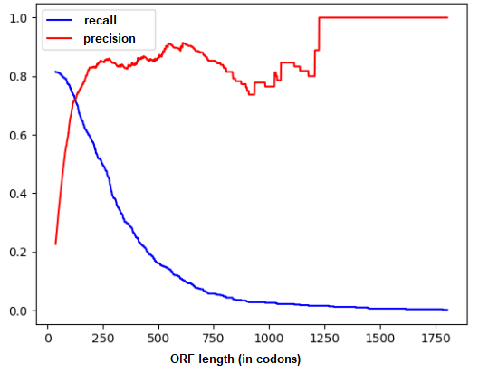
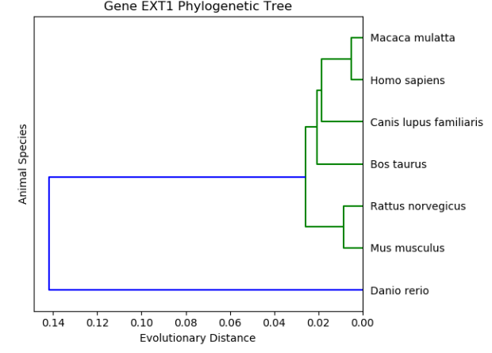

# Bioinformatics
Several Python programs that solve various bioinformatics computational problems found on the [Rosalind](https://rosalind.info/about/). 
Repository also contains three mini projects that focus on analysing molecular data to answer specific questions. 

Homework for the Introduction to Bioiformatics course at the University of Ljubljana, Faculty of Computer and Information Science. 
The course covered the following main topics: molecular biology, probability models, gene finding, sequence alignment, Markov models, models of evolution, phylogenetic and sequence assembly.

## Rosalind
Bellow we list the solved problems and provide links to the Rosalind webpage containing description and dataset. File name represents a Rosalind ID of the individual problem. 

* `DNA.py` [Counting DNA Nucleotides](https://rosalind.info/problems/dna/) 
* `RNA.py` [Transcribing DNA into RNA](https://rosalind.info/problems/rna/) 
* `REVC.py` [Complementing a Strand of DNA](https://rosalind.info/problems/revc/) 
* `GC.py` [Computing GC Content](https://rosalind.info/problems/gc/) 
* `PROT.py` [Translating RNA into Protein](https://rosalind.info/problems/prot/) 
* `SUBS.py` [Finding a Motif in DNA](https://rosalind.info/problems/subs/) 
* `KMER.py` [k-Mer Composition](https://rosalind.info/problems/kmer/) 
* `LEXF.py` [Enumerating k-mers Lexicographically](https://rosalind.info/problems/lexf/) 
* `KMP.py` [Speeding Up Motif Finding](https://rosalind.info/problems/kmp/) 
* `PROB.py` [Introduction to Random Strings](https://rosalind.info/problems/prob/) 
* `ORFR.py` [Finding Genes with ORFs](https://rosalind.info/problems/orfr/) 
* `ORF.py` [Open Reading Frames](https://rosalind.info/problems/orf/) 
* `PDST.py` [Creating a Distance Matrix](https://rosalind.info/problems/pdst/) 
* `HAMM.py` [Counting Point Mutations](https://rosalind.info/problems/hamm/) 
* `EDIT.py` [Edit Distance](https://rosalind.info/problems/edit/) 
* `EDTA.py` [Edit Distance Alignment](https://rosalind.info/problems/edta/) 
* `GLOB.py` [Global Alignment with Scoring Matrix](https://rosalind.info/problems/glob/) 
* `LOCA.py` [Local Alignment with Scoring Matrix](https://rosalind.info/problems/loca/) 
* `GAFF.py` [Global Alignment with Scoring Matrix and Affine Gap Penalty](https://rosalind.info/problems/gaff/) 
* `BA10A.py` [Compute the Probability of a Hidden Path](https://rosalind.info/problems/ba10a/) 
* `BA10B.py` [Compute the Probability of an Outcome Given a Hidden Path](https://rosalind.info/problems/ba10b/) 
* `BA10C.py` [Implement the Viterbi Algorithm](https://rosalind.info/problems/ba10c/) 
* `BA10I.py` [Implement Viterbi Learning](https://rosalind.info/problems/ba10i/) 
* `BA10K.py` [Implement Baum-Welch Learning](https://rosalind.info/problems/ba10k/) 
* `BA10D.py` [Compute the Probability of a String Emitted by an HMM](https://rosalind.info/problems/ba10d/) 
* `BA10H.py` [Estimate the Parameters of an HMM](https://rosalind.info/problems/ba10h/) 
* `BA10J.py` [Solve the Soft Decoding Problem](https://rosalind.info/problems/ba10j/) 
* `TRAN.py` [Transitions and Transversions](https://rosalind.info/problems/tran/) 
* `CONS.py` [Consensus and Profile](https://rosalind.info/problems/cons/) 
* `REVP.py` [Locating Restriction Sites](https://rosalind.info/problems/revp/) 
* `SPLC.py` [RNA Splicing](https://rosalind.info/problems/splc/) 
* `DBRU.py` [Constructing a De Bruijn Graph](https://rosalind.info/problems/dbru) 
* `PCOV.py` [Genome Assembly with Perfect Coverage](https://rosalind.info/problems/pcov/) 
* `GREP.py` [Genome Assembly with Perfect Coverage and Repeats](https://rosalind.info/problems/grep/) 
* `LCSM.py` [Finding a Shared Motif](https://rosalind.info/problems/lcsm/) 

## Mini projects
Files "porocilo.pdf" contain more detailed reports for the projects in the Slovenian language. 

### Gene Prediction
We analyse the whole genome of Mycoplasma genitalium bacteria and try to find the regions that encode genes, especially those that encode proteins. 
We find optimal ORF length for our algorithm based on recall and precision measures. 

### DNA evolution
We search for a gene that would enable us to best distinguish between a Danio rerio fish and a group of six mammals. 
Using a distance measure derived from the Jukes-Cantor model we are able to compare the same gene between different species and then plot a phylogenetic tree.

### Sequence Reconstruction
We search several gene sequences for the minimal length of fragments that we can then still reconstruct into the original sequence. 
This is done iteratively by first heuristically estimating the fragment length and then creating de Brujin graph for smaller and smaller fragments until only one unique Euler's path can be found. 
